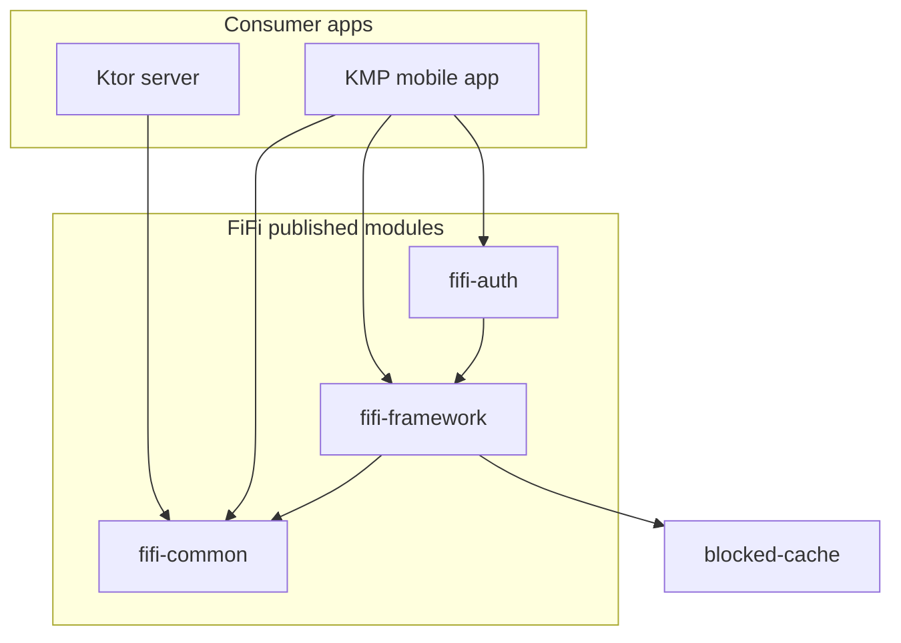
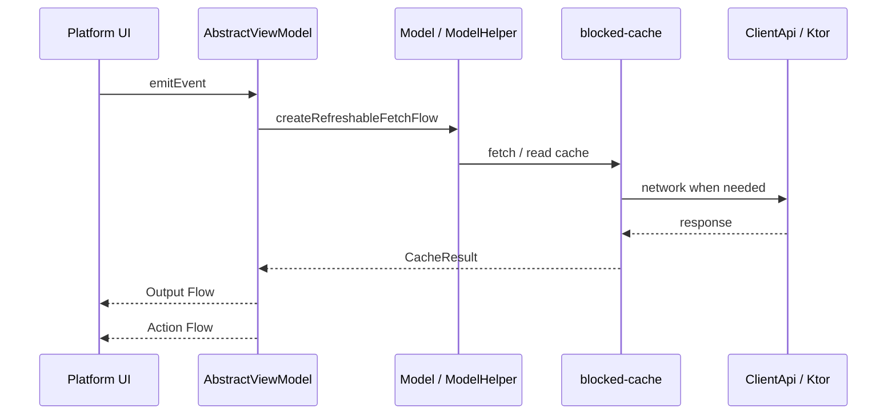

# FiFi Architecture

## Module diagram

## Data flow

## Key types

| Package | Types | Role |
|---------|-------|------|
| `viewmodel` | `AbstractViewModel`, `AbstractEvent`, `VoidEvent` | MVVM core |
| `utils` | `ActionHandler`, `Emitter` | Event → action routing |
| `utils.flow` | `FlowAdapter`, `wrap()` | Cross-platform Flow bridging |
| `model` | `Model`, `ModelImpl`, `ModelHelper`, `DataContainer` | Data layer + cache |
| `loading` | `Loadable`, `asLoadable()` | CacheResult → UI-agnostic state |
| `di` | `AppDefinition`, `initKoinApp`, `PersistentDataRegistry` | Bootstrap |
| `api` | `ClientApi`, `ClientApiImpl`, `ApiFactory` | HTTP layer |
| `ui.component` | `TextDefinition`, `ConfirmationDialogDefinition` | Minimal shared UI contracts |
| `auth` | `AuthAppDefinition`, `AuthApiHelper`, `TokenStore` | Optional auth (fifi-auth) |

## Platform ViewModel lifecycle

| Platform | Scope | Cleanup |
|----------|-------|---------|
| Android | `androidx.lifecycle.ViewModel` + `viewModelScope` | Automatic |
| iOS / JVM | `AppMainScope()` | Manual `clear()` required |

## Persistence

- **Android:** `AndroidApp.setupAppModel()` debounces JSON persistence of registered `DataContainer`s per environment.
- **iOS:** Not provided — apps implement disk restore (e.g. a Swift `DataStore` that serializes `CDataContainer.json`).

## Sample app

The coffee browse sample (`sample/shared`) demonstrates:

- `AppDefinition` without auth
- `ModelHelper` + blocked-cache
- `HomeViewModel` with `createRefreshableFetchFlow`
- Android Compose via `ViewModelComposable`
